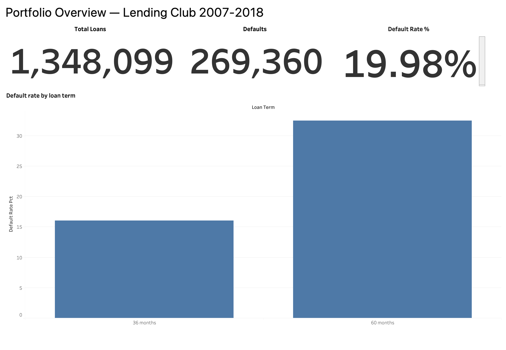
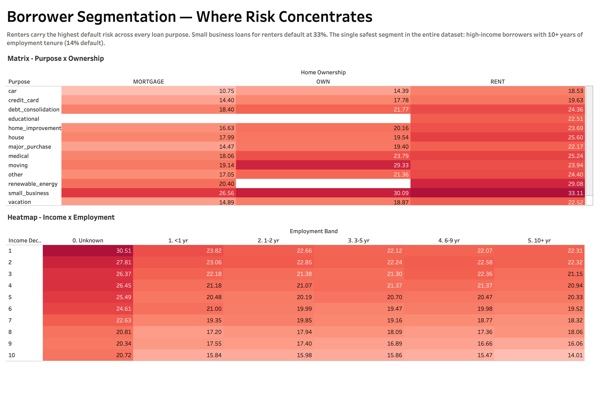
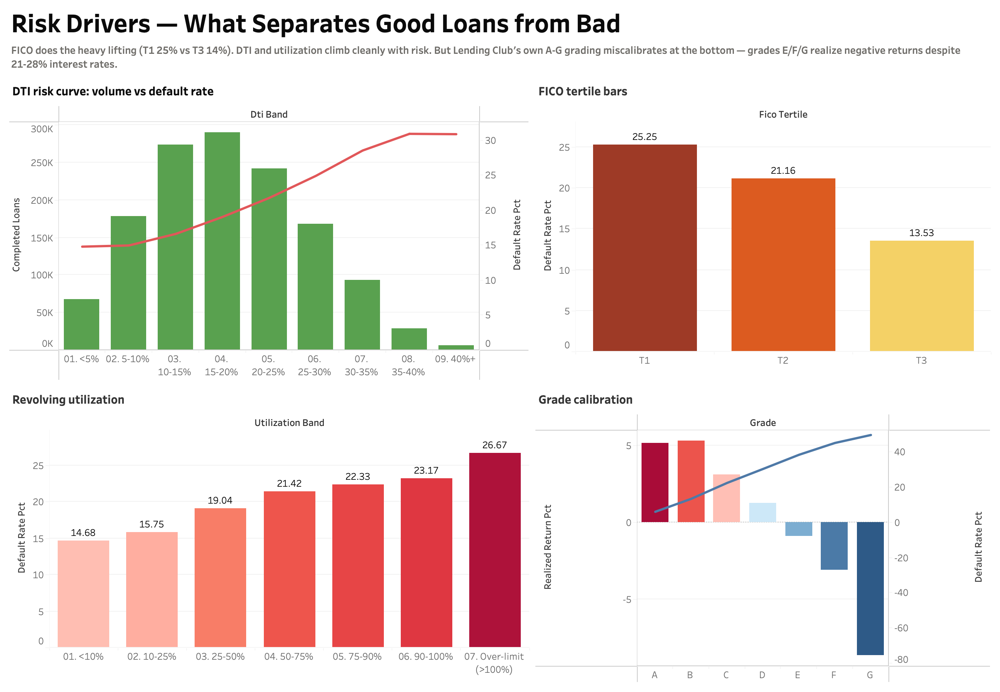
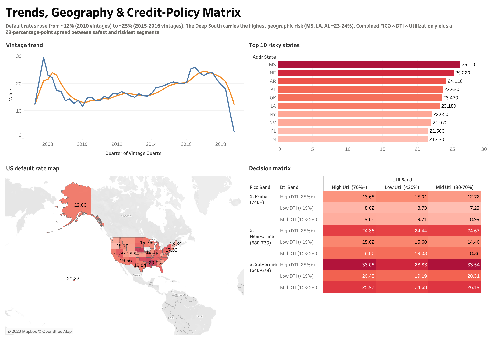

# Loan Default Risk Analysis — Lending Club 2007-2018

End-to-end risk analytics project on **2.3 million Lending Club loans** issued 2007 through Q4 2018. SQL queries answer business questions a Data Analytics team at a consumer lender actually asks; a Tableau dashboard surfaces the results for portfolio monitoring.

**Stack:** DuckDB (PostgreSQL-flavored SQL) · Tableau Public · Python (for loading)

---

## Why this project

Consumer lenders make money by deciding who to lend to and pricing the risk that borrowers don't repay. Two questions drive every decision:

1. **Who is the borrower?** — credit score, income, employment, prior credit usage
2. **What's the loan?** — size, term, purpose, pricing relative to risk

This repo answers both, end-to-end, with SQL and visualizes the result in Tableau.

The Lending Club dataset is particularly useful here because it's a **real licensed lender's complete loan book** — every loan funded between 2007 and 2018, with both the application-time features (FICO, DTI, employment) and the realized outcome (paid off vs charged off). That makes it possible to do real risk-calibration work, not just demographic slicing.

---

## Repository layout

```
loan-default-analysis/
├── sql/                 # 10 analytical queries, numbered and themed
├── notebooks/           # Data loading + sanity-check notebooks
├── scripts/             # Download + DB build scripts
├── dashboard/
│   ├── loan_risk.twbx              # Tableau workbook
│   ├── loan_default_powerbi.xlsx   # Consolidated 10-sheet Excel (Tableau input)
│   └── data/                        # CSV exports of query results
├── screenshots/         # Dashboard page screenshots
├── data/
│   ├── raw/             # Lending Club CSVs (gitignored)
│   └── processed/       # DuckDB database (gitignored)
└── README.md
```

---

## Reproduce

### 1. Get the data
Lending Club 2007-2018 on Kaggle: <https://www.kaggle.com/datasets/wordsforthewise/lending-club>

```bash
# Requires Kaggle API auth set up (~/.kaggle/kaggle.json or access_token)
bash scripts/download_data.sh
```

### 2. Build the database
```bash
python scripts/build_duckdb.py
# → produces data/processed/lending_club.duckdb
```

### 3. Run queries
```bash
# Interactive
duckdb data/processed/lending_club.duckdb

# Or run all and export to dashboard/data/
python scripts/run_all_queries.py
```

### 4. Open the dashboard
Open `dashboard/loan_risk.twbx` in [Tableau Public](https://public.tableau.com/) (free, Mac/Windows). The workbook reads from `dashboard/loan_default_powerbi.xlsx`, which is a consolidated 10-sheet Excel built from the CSV exports (one sheet per SQL query). Regenerate with `python scripts/build_powerbi_excel.py`.

---

## SQL queries

| # | File | Question | Techniques |
|---|------|----------|------------|
| 01 | `01_default_rate_overview.sql` | Baseline default rate, sliced by term and grade | Filtered aggregation, ROLLUP |
| 02 | `02_default_by_purpose_ownership.sql` | Default rate by loan purpose × home ownership | CTE, 2-D GROUP BY, HAVING |
| 03 | `03_default_by_income_employment.sql` | Income decile × employment tenure heatmap | NTILE window, CTE chain |
| 04 | `04_dti_risk_curve.sql` | Debt-to-income → default rate curve | CASE bucketing |
| 05 | `05_fico_score_tertiles.sql` | FICO tertile lift on default | NTILE window |
| 06 | `06_grade_calibration.sql` | Are Lending Club's own A-G grades well-calibrated? Realized return vs default rate | Derived metrics, conditional aggregation |
| 07 | `07_vintage_cohort_analysis.sql` | Default-rate trend across quarterly origination cohorts, 4Q rolling | DATE_TRUNC, AVG window with ROWS frame, LAG |
| 08 | `08_state_geographic_risk.sql` | State-level default ranking vs portfolio benchmark | AVG OVER (), RANK window |
| 09 | `09_revolving_utilization.sql` | Credit-card utilization → default risk | CASE bucketing, multi-metric |
| 10 | `10_risk_segmentation_model.sql` | FICO × DTI × Utilization credit-policy decision matrix | Multi-stage CTE, decision mapping |

---

## Dashboard

Four pages built in Tableau Public. The packaged workbook (`dashboard/loan_risk.twbx`) is in the repo — open it with [Tableau Reader](https://www.tableau.com/products/reader) (free) or [Tableau Public Desktop](https://www.tableau.com/products/public) to interact with the visuals directly.

### Page 1 — Portfolio Overview
Total loans, defaults, default rate, and default-rate split by 36- vs 60-month term.



### Page 2 — Borrower Segmentation
Default rate matrix by loan purpose × home ownership, and the income-decile × employment-tenure heatmap. Renters carry the highest risk across every purpose; small business loans for renters default at 33%.



### Page 3 — Risk Drivers
DTI risk curve, FICO tertile lift, revolving utilization, and the **grade-calibration chart** showing realized returns going negative for grades E-G despite 21-28% interest rates.



### Page 4 — Trends, Geography & Decision Matrix
Quarterly vintage cohort default-rate trend (raw + 4Q rolling), filled US map by state, top 10 highest-risk states, and the combined FICO × DTI × Utilization credit-policy decision matrix.



---

## Key findings

Run on **1,348,099 completed loans** (out of 2,260,701 funded between 2007 and 2018Q4).

**1. Baseline default rate is ~20% — but term and grade reshape it dramatically.**
The overall completed-loan default rate is **19.98%**. Split by term, 36-month loans default at **16.02%**, while 60-month loans default at **32.45%** — roughly **2× the rate**, despite carrying only a 4.6 percentage-point higher average interest rate. The longer-term book is materially riskier than headline pricing suggests.

**2. Lending Club's own grading model broke down at high-risk grades.**
This is the most actionable finding for a lending team. Realized return by LC grade:

| Grade | Default rate | Avg int rate | Realized return | Loss given default |
|-------|--------------|--------------|-----------------|--------------------|
| A | 6.04% | 7.11% | **+5.19%** | 52% |
| B | 13.40% | 10.68% | **+5.32%** | 56% |
| C | 22.44% | 14.02% | **+3.10%** | 61% |
| D | 30.38% | 17.71% | **+1.25%** | 65% |
| E | 38.43% | 21.11% | **−0.90%** | 69% |
| F | 45.15% | 24.88% | **−3.14%** | 72% |
| G | 49.67% | 27.54% | **−8.69%** | 75% |

Grades A-D were profitable. **Grades E, F, and G lost money even at 21-28% interest** — defaults and loss-given-default outpaced the rate. Lending Club's pricing curve was too flat at the bottom of the credit spectrum.

**3. FICO does most of the underwriting work — but no FICO band is "safe".**
The lowest FICO tertile (612-677) defaults at **25.25%**; the top tertile (707-847) at **13.53%**. That's an 11.7-point lift — the single strongest separator in the dataset. But even the top tertile defaults at >13%, meaning the baseline risk is structurally high.

**4. DTI shows a clean monotonic risk curve.**
Default rate rises from **14.8% (DTI <5%)** to **30.9% (DTI 35-40%)**. The curve confirms textbook intuition: borrowers committing more income to debt service are materially more likely to default — and the bank's interest rate only rises from 12.2% to 16.8% across the curve, far less than the risk gradient.

**5. Revolving utilization is FICO's complement, not duplicate.**
Default rate rises from **14.68% (util <10%)** to **26.67% (over-limit >100%)**. The compounding signal: borrowers with 90%+ util also have lower average FICO (683 vs 744) — confirming utilization captures distress that FICO already partly sees, but adds a margin.

**6. Vintage drift is real and visible.**
Default rates by origination quarter rose from low-teens in 2010-2012 vintages to over 20% in 2015-2016 vintages — consistent with the well-documented "credit easing" period when Lending Club expanded volume. The 4-quarter rolling average smooths the trend and is the line a credit committee would actually review. *(2018 vintages cannot be evaluated yet — most of those loans are still in progress.)*

**7. Decision matrix: no auto-approve cell exists in this book.**
Combining FICO × DTI × Utilization into 27 cells, the lowest-risk segment (Prime FICO 740+, Mid Util, Low DTI) defaults at **7.29%** — better than baseline but not "auto-approve" territory. The highest-risk cell (Sub-prime FICO, High DTI, Mid Util) defaults at **33.54%**. The matrix is a direct credit-policy artifact: a manager could use it to set cutoffs for auto-approve, manual review, and decline.

---

---

## Notes on methodology

- **"Default" = loan_status ∈ {'Charged Off', 'Default'}**, "paid" = 'Fully Paid'.
- Default-rate calculations are restricted to **completed loans** (excluding 'Current', 'Late', and 'In Grace Period') — including in-progress loans would mechanically depress the rate.
- `dti` and `revol_util` in Lending Club are observed *at origination*, not snapshot-current. They are application-time features.
- `int_rate` and `revol_util` arrive as strings with '%' suffix; the load script strips and casts to DOUBLE.
- `issue_d` arrives as 'Mon-YYYY' (e.g. 'Dec-2015') and is parsed to a proper DATE.
